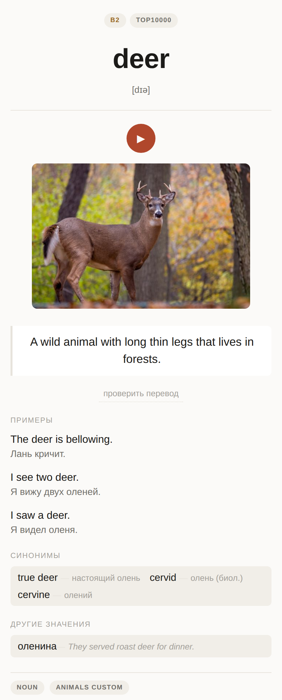

# Vocabulary → Anki

Turns a list of words you are learning into finished Anki cards. Each card gets a definition in
the language you learn, translations into your own language, example sentences, synonyms and
antonyms, a verb's forms, a picture and a recording.



Almost nothing on a card is invented. A published dictionary decides what a word means. A
published graded word list decides how hard it is. A frequency table decides which words you see
first. A language model does only what no dictionary publishes: it rewrites a hard definition in
simple words, and it translates.

*The card above: definition from Wiktionary, examples from Tatoeba, level from the CEFR-J
Wordlist, photo by World Wildlife on StockSnap (CC0).*

## Which languages work

You pick two languages: the **target** (the one you learn) and your **native** one (the one cards
are translated into). Both are two-letter codes.

| | ready today | any other code |
|---|---|---|
| target | `en`, `es`, `de`, `ru` | builds, but stops at the dictionary step until that Wiktionary edition gets a parser — see [Adding a language](#adding-a-language) |
| native | any language the model can translate into | — |
| card headings | `ru`, `en`, `pl`, `ar` | headings stay in English |

So an English speaker learning Spanish, a Pole learning German, or a Russian speaker learning
English can start now.

## Quick start

The example builds a Spanish deck for an English speaker. Change the two codes for your pair.

**1. Install.** You need Python 3.11 or newer.

```
git clone https://github.com/nistepanov/my_anki.git
cd my_anki
python -m venv .venv && source .venv/bin/activate
pip install -r requirements.txt
```

**2. Set up Anki.** Install [Anki](https://apps.ankiweb.net/) and the
[AnkiConnect](https://ankiweb.net/shared/info/2055492159) add-on. AnkiConnect lets the build send
cards to Anki. Anki must be open when you push. The build creates the note type and decks itself.

**3. Get a model key (optional).** Some stages need a language model. Set `ANTHROPIC_API_KEY` and
the build can answer them through the API. Without a key you answer them yourself — see
[step 6](#the-build-will-stop-and-wait-for-you).

```
export ANTHROPIC_API_KEY=...
export PIXABAY_API_KEY=...   # optional: one more picture source
```

**4. Write your words.** Put them into `words/<target>.txt`, one per line — here `words/es.txt`.
The files in `words/` are the author's own lists; replace them with yours.

```
casa
el perro
correr<TAB>to run
```

A line can carry your own translation after a tab. It is optional, but it helps the build pick
the right meaning of a word with several.

**5. Build.**

```
python build.py --target es --native en
```

`--target` and `--native` default to `en` and `ru`. Add `--no-push` to build without Anki,
`--images` to look for pictures, `--skip-media` to skip recordings too.

**6. Answer the questions, then build again.** The first run stops at the stages that need a model
and tells you which task directories to answer. With an API key:

```
python -m pipeline.llm data/es/sense_choice   # one call per directory the build names
python build.py --target es --native en
```

Repeat until the build pushes the deck. A run after you add five words does only five words of
work, so you can add words and run it again at any time.

**7. Make the deck yours (optional).** Create `languages/<target>.<native>.json` — here
`languages/es.en.json`:

```json
{
  "deck": "Spanish",
  "card_templates": ["recognition", "recall"]
}
```

This file holds your choices: the deck name, which kinds of card you want, which levels you have
already finished. See [facts about one learner](#languagestargetnativejson--facts-about-one-learner).
The `*.ru.json` files in `languages/` are the author's; they apply only to Russian speakers.

## More about the build

The build runs the stages in order and each one skips what is already done, so a run after adding
five words does five words of work. Nothing is thrown away and nothing already paid for is
recomputed. A word already in the deck is ignored, so old lines can stay in the file.

Pictures are off by default because most words do not need one, and the picture search is the
slowest part of a run.

### The build will stop and wait for you

Three stages need judgement a script cannot supply — which dictionary sense a card should teach,
the fields no dictionary publishes, and the missing example translations. Where those have work
outstanding, the stage writes it out as numbered task files with a `INSTRUCTIONS.md` beside them
and the build says so. Answer them, run the build again, and it carries on.

You can answer them three ways:

```
python -m pipeline.llm data/en/llm --model claude-sonnet-5   # through the API
./enrich.sh                                                  # the same, for a crontab
```

or by writing the `answer-NN.json` files yourself, which is what an agent session does. `enrich.sh`
takes a lock, logs, and never touches Anki — publishing a deck stays a person's decision.

One warning that has bitten here: **clear a stage's task directory before planning a new round.**
The merge step reads every answer file it finds, so answers to a question no longer being asked
get applied again, and the correction you were making is silently reverted.

### Starting from a published word list

Some languages have an official list published by an exam board, and it beats anything you would
type by hand: it brings the level, the grammar and an example sentence with every word. German has
one, imported once before the first build:

```
python -m pipeline.goethe --target de
```

For other languages a graded lexicon fills the level where it can:

```
python -m pipeline.graded_lexicon --target en
```

Words from these and words you add by hand live in the same table, so both can be re-run any time.

### Teaching the book you are reading

The words in a book you are actually reading are better than any list, and a phrase the author
wrote beats an invented example:

```
python -m pipeline.book_import tasks --target en --directory data/en/book_80_days \
    --epub sources/around-the-world-in-80-days.epub
# answer each task_NN.json into an answer_NN.json beside it, then:
python -m pipeline.book_import rows  --target en --directory data/en/book_80_days \
    --subdeck 'Around the World in 80 Days'
```

It keeps only the words the frequency table says you do not know yet, each on a phrase from the
book. This one is English-only for now — see [Adding a language](#adding-a-language).

## What a card holds

A word gets up to three cards, and which ones is set per language:

| | asks |
|---|---|
| recognition | the bare word — what does this mean? |
| context | a sentence with the word marked — what does the marked word mean? |
| recall | your own language — what is the word? |

Where a word has a sentence worth using, the context card replaces the recognition one rather than
joining it: both ask what a word means, and the one with more to go on is the one worth answering.
A word with no such sentence keeps the bare card. The English deck drops `recall` entirely, because
that learner already reads English and never needs to produce these words.

Every card carries the headword with its article and gender, a definition at roughly A2 level
with translations, three example sentences each translated, synonyms and antonyms with glosses,
the headword's other meanings, a verb's forms, a picture where the word names something you could
photograph, and a recording. Level, frequency band, part of speech and topic become tags.

Cards go into a subdeck named for their CEFR level. Anki hands out new cards subdeck by subdeck in
name order, and level names already sort into study order, so that buys the whole progression for
free. Inside one level the order is by frequency, because a level holds well over a year of study
and the order inside it decides most of what you actually see. Levels you have finished can be
named in the config; their cards are suspended rather than deleted and move to a deck of their own.


The back of a recognition card, as `pipeline.preview` renders it. The photograph is CC0, by Markus
Spiske on StockSnap.

To see a card without opening Anki:

```
python -m pipeline.preview --target en --word resilience
```

## Pushing to Anki

```
python -m pipeline.anki --target en
```

Idempotent: a note is looked up by its key first, then updated or created. Anki silently refuses a
note whose first field already exists, and refusal looks exactly like success from the outside,
which is why the lookup is not optional. The two counts are reported separately.

Pictures and recordings already on a note are left alone, because they also arrive from places
this pipeline does not control — a text-to-speech pass inside Anki, a hand-picked replacement.
`--replace-media` makes the manifest win instead, which is how a picture judged wrong actually
leaves the deck. `--design-only` pushes edited templates and styling without touching notes.

## Where things live

| | |
|---|---|
| `words/` | the lists you keep by hand — the only files you edit |
| `languages/` | one config per language, plus one per learner of it — see [Adding a language](#adding-a-language) |
| `templates/` | how a card looks; `templates/<code>/` overrides one deck's design |
| `sources/` | raw imports, such as a vocabulary app's backup or an ebook |
| `pipeline/` | the stages |
| `data/` | everything generated, one directory per language |
| `.agents/` | what the pipeline does and why, in prose |
| `docs/` | pictures for this README |

Nothing under `data/` is written by hand. It can be deleted and rebuilt, though the caches in it
are what make a rebuild cheap, so deleting them means paying for every lookup again. It is not in
the repository, and neither are the raw imports.

## Running one stage on its own

Every stage is a module you can run alone while working on it. All of them take `--target` — it is
required and has no default — and `--native`, which defaults to `ru`. Many take `--limit N`, to work
on the first few rows while you are still checking what a stage does. The stages that rewrite rows
without asking anybody first take `--dry-run`, which prints the change and writes nothing.

The commands below use `--target en`; swap the code for another deck.

### The table the stages pass along

Three files under `data/<target>/`, each stage reading one and writing the next or itself:

| | written by | holds |
|---|---|---|
| `words.tsv` | whatever brought the words in | one row per word, most cells empty |
| `enriched.tsv` | the dictionary stage | the same rows with what a dictionary could answer |
| `cards.tsv` | the model stage, then everything after it | the finished rows the Anki push reads |

A stage never drops a column it does not know about, so running them out of order costs a rerun
rather than data.

### Getting words in

```
# the list you keep by hand — this is what build.py calls
python -m pipeline.wordlist words/en.txt --target en

# an exam board's published list, German only
python -m pipeline.goethe --target de

# a vocabulary app's SQLite backup
python -m pipeline.reword sources/my.backup --target es

# a book you are reading: words you do not know yet, each on a phrase from the book
python -m pipeline.book_import tasks --target en --directory data/en/book_x --epub sources/book.epub
# answer each task_NN.json into an answer_NN.json beside it, then:
python -m pipeline.book_import rows --target en --directory data/en/book_x --subdeck 'Book X'
```

The book importer keeps its questions in its own format and writes no instructions file, so the
script that answers task files cannot read them — they are answered in a session or by hand. Every
other stage below uses the shared format.

### Filling a card from published data

Free, deterministic, no model. Each caches its own lookups, so a rerun costs nothing for the rows
already done.

```
python -m pipeline.dictionaries --target en   # definitions, synonyms, antonyms, corpus sentences
python -m pipeline.frequency --target en      # the frequency band
python -m pipeline.graded_lexicon --target en # the CEFR level, from a published graded list
python -m pipeline.transcription --target en  # the phonetic transcription
python -m pipeline.inflections --target es    # a verb's forms, from the conjugation table
python -m pipeline.context_cards --target en  # which sentence a context card is built on
```

Add `--refresh` to `dictionaries` or `frequency` to redo rows that are already filled.

### The stages that ask a question

These cannot finish on their own. Each writes numbered task files with an `INSTRUCTIONS.md` beside
them, waits for `answer-NN.json` files, and merges those back. Always three steps:

```
python -m pipeline.model --target en --plan                     # write the questions
python -m pipeline.llm data/en/llm --batch                      # answer them through the API
python -m pipeline.model --target en --from-json data/en/llm     # merge the answers
```

`--slices N` splits the questions into more, smaller files. The same three steps work for:

| stage | asks for | task directory |
|---|---|---|
| `pipeline.sense_choice` | which sense a new word's card teaches | `data/en/sense_choice` |
| `pipeline.model` | the fields no dictionary publishes, and simpler wording | `data/en/llm` |
| `pipeline.translations` | the missing example translations | `data/en/examples` |
| `pipeline.relations` | synonyms sorted and glossed | `data/en/relations` |
| `pipeline.senses` | the headword's other meanings | `data/en/senses` |
| `pipeline.primary_sense` | whether a card teaches the sense met first | `data/en/primary_sense` |

**Empty a task directory before planning a new round.** The merge reads every answer file it finds,
so answers to a question no longer being asked get applied again — and the correction you were
making is what gets reverted. Numbering does not save you: a smaller second round leaves the
higher-numbered files of the first one in place and they merge alongside the new ones.

`pipeline.llm` takes a directory, not a `--target`. `--batch` submits everything as one batch at
half price, answered whenever the service gets to it; without it, questions go chunk by chunk and
answer sooner. `./enrich.sh` runs the three stages the build waits on in this way, for a crontab.

### Pictures and recordings

The build fetches recordings only. Pictures are a separate ask — `build.py --images`, or here:

```
python -m pipeline.media --target en               # recordings and curated pictures
python -m pipeline.media --target en --only audio  # or --only image
python -m pipeline.reword_media sources/my.backup --target es  # media out of the app's backup
```

A searched picture takes four steps, because somebody has to look at it:

```
python -m pipeline.images --target en --plan-queries                       # ask for search phrases
python -m pipeline.llm data/en/image_queries --batch                       # the model answers those
python -m pipeline.images --target en --plan --queries-from data/en/image_queries
# now look at the candidates under data/en/candidates/ and write the answer files
python -m pipeline.images --target en --from-json data/en/image_review
```

Only the query step can go through `pipeline.llm`. Choosing among candidates means looking at
pictures, which the text API cannot do, so that answer comes from a session or from you.
`--retry-rejected` searches again for words a reviewer turned down, which is worth doing after
adding a provider. To check the pictures already on cards: `--audit`, then `--audit-from
data/en/image_audit`.

### A searched picture is looked at before it lands

`pipeline.media` runs a chain of providers declared per language, and it carries only sources
curated before they arrived — whatever the word list shipped, a visual dictionary where a person
chose the photograph. Anything found by searching goes through `pipeline.images`, which offers
candidates and takes a verdict.

That split is deliberate and not a convenience. The moment two paths can write the same picture
cell, the cheap one silently undoes the careful one: a media run here re-pictured the very words a
review had twice cleared as unpicturable. A language with no curated image source simply has an
empty chain, and every picture comes through review.

### Repairing what is already built

```
python -m pipeline.duplicates --target en --dry-run     # fold cards that teach one word twice
python -m pipeline.sense_pruning --target en --dry-run  # drop related words of another meaning
```

Both print what they would do and change nothing until you drop `--dry-run`. Nothing is deleted: a
folded row stays and records which card it went into, so a bad fold is found by reading a column.

### Into Anki

Anki has to be running for all of these.

```
python -m pipeline.anki --target en                  # push the notes
python -m pipeline.anki --target en --design-only    # only refresh templates and styling
python -m pipeline.anki --target en --replace-media  # let the manifest overwrite media
python -m pipeline.ordering --target en              # order the new-card queue by frequency
python -m pipeline.mastered --target en              # suspend the levels you have finished
```

`--url` points at a different AnkiConnect endpoint. To see a card without Anki at all:

```
python -m pipeline.preview --target en --word resilience
```

## Adding a language

No stage names a language. What differs between two decks is a config file, and most of a config
file is optional — a language with no file at all still builds, from what its two-letter code
implies: its Wiktionary edition, its Wikipedia, its corpus code, its articles, and a recording
provider. So start by running it and see what comes out.

```
python build.py --target pl --native ru --no-push --skip-media
```

Then fix what the run tells you. Two files matter.

### `languages/<target>.json` — facts about the language

One key per thing the code cannot derive. Every key is optional; look at `en.json`, `es.json`,
`de.json` and `ru.json` for worked examples, and at the `*_note` keys beside them, which record
why each value is what it is.

| | |
|---|---|
| `wiktionary_host` | a different edition, when the language's own has no dialect described |
| `wiktionary_section` | how that edition names this language in its own headings |
| `articles` | the articles to split off a headword, so cards can drill them separately |
| `graded_lexicon` | published word lists stating a CEFR level, where any exist |
| `media` | which picture and recording providers to use, best first |
| `inflection` | which rows of a conjugation table reach the card, and their labels |
| `grammar_words` | words a learner reads without being taught them |
| `filler_words` | words every definition reaches for, whatever it defines |
| `inflection_endings` | endings a reader passes straight through, as `[ending, replacement]` |
| `definition_openers` | phrases a definition wears only to announce a part of speech |
| `participle_suffix` | the ending a noun's definition uses where a verb's uses the stem |

The last five are what keep the shared stages honest. A language that states none of them is
matched on the written form: fewer sentences qualify, fewer cards fold together, and nothing is
accepted wrongly. Leaving them out is a safe start, not a bug — and the fallback for the two word
lists is the language's commonest words from a frequency table, which is rougher in both
directions, so they are worth writing for a deck you care about.

### `languages/<target>.<native>.json` — facts about one learner

How far along *you* are is not a fact about the language, and it must not be, or the next learner
of the same language inherits your deck. So it lives in its own file, keyed on both codes, and it
is merged over the language's own.

| | |
|---|---|
| `deck` | what your deck is called in Anki |
| `mastered_deck` | a separate top-level deck for the levels you have finished |
| `mastered_levels` | those levels; their cards are suspended, never deleted |
| `card_templates` | which kinds of card you still need |
| `superseded_cards` | which card stands down for which, where both could be built |

`en.ru.json` is the worked example: a reader who already knows English up to B1 and has no use for
the card that asks them to produce a word.

### What each new language actually costs

Expect to spend the effort on four things, in this order:

1. **The dictionary.** A language whose own Wiktionary edition has no dialect described will say
   so and stop, by name. Do not route around it by reading a third edition: an edition written in
   another language translates foreign words rather than defining them, so the card's definition
   comes back as a one-word gloss and the whole premise — that a dictionary decides meaning —
   is gone. Describing an edition is bounded work: an edition either marks a sense in the line
   itself, or writes every list the same way and says what the list is in the heading above it.
2. **The CEFR level.** Look for an official graded word list before settling for a judgement;
   where none exists the level is the model's guess anchored on frequency, and should be called
   approximate.
3. **The corpus.** Translation coverage into your own language is usually far thinner than into
   English. Check before relying on it — a corpus with plenty of sentences and none translated
   reads exactly like a corpus with nothing.
4. **The word lists above.** Write them once the deck exists and you can see which sentences it
   is letting through.

### What is still tied to one language

Two entry points, both optional and neither depended on by anything:

- The **exam board importer** reads the German exam board's PDFs. Another language simply does not
  run it, which is the plug-in rule working.
- The **book importer** and the **vocabulary-app backup importer** are written for English and
  Russian throughout — English endings and alphabet, the `to` infinitive marker, fixed column
  names. They are how words get *in*, so another language uses the plain word list instead and
  loses nothing else.

Media filenames used to belong here too. A filename is built from the card's key, which carries a
gloss in your own language, and the table that made it filesystem-safe knew Cyrillic and Spanish
accents only — so for any other script the gloss contributed nothing, two senses of one headword
asked for the same file, and the media run stopped on the clash. A key whose script the table does
not describe now gets a short tail from the key itself. Arabic, Hebrew, Greek and Japanese glosses
were checked; no existing English or Spanish filename moved, and the twenty-one German ones that
did were corrections.

And one gap that degrades rather than breaks: card section headings exist for Russian, English,
Polish and Arabic readers. Another reader gets them in English until a set is added beside those.

## Licence and sources

The code is MIT — see `LICENSE`. Two things in the repository are not:

- `words/en.txt` includes words from the [CEFR-J Wordlist](https://github.com/openlanguageprofiles/olp-en-cefrj)
  (free to use with a citation: *The CEFR-J Wordlist Version 1.5, compiled by Yukio Tono, Tokyo
  University of Foreign Studies*) and from the Octanove Vocabulary Profile C1/C2
  ([CC BY-SA 4.0](https://creativecommons.org/licenses/by-sa/4.0/)). That file is shared under
  CC BY-SA 4.0.
- `docs/card-example.png` shows text from Wiktionary (CC BY-SA 4.0) and Tatoeba (CC BY 2.0 FR),
  and a CC0 photo.

The repository holds no dictionary data, sentences, pictures or recordings. The build downloads
them to `data/` on your machine, and each source keeps its own terms:

| source | gives | terms |
|---|---|---|
| [Wiktionary](https://www.wiktionary.org/) | definitions, synonyms, verb forms, IPA | CC BY-SA 4.0 |
| [Tatoeba](https://tatoeba.org/) | example sentences and translations | CC BY 2.0 FR |
| [wordfreq](https://github.com/rspeer/wordfreq) | word frequency | code Apache 2.0, data CC BY-SA 4.0 |
| CEFR-J, Octanove | English levels | see above |
| [EFLLex, ELELex](https://cental.uclouvain.be/cefrlex/) | English and Spanish levels | CC BY-NC-SA 4.0 — non-commercial |
| [Goethe-Institut word lists](https://www.goethe.de/) | German words and levels | copyrighted PDFs — personal use |
| [rae-api.com](https://rae-api.com/) | Spanish definitions | unofficial API; content © Real Academia Española — personal use |
| [Openverse](https://openverse.org/), [Pixabay](https://pixabay.com/) | pictures | per picture; the search asks only for commercial-use licences |
| Wikipedia | pictures, as a fallback | per picture; the licence is not recorded — check before you share |
| Wikimedia Commons | recordings | per file, mostly CC BY-SA |
| Google Translate TTS, SpanishDict | synthesized pronunciation | unofficial endpoints, no licence — personal use |
| Super Español | Spanish pictures and recordings | no licence stated — personal use |
| Anthropic API | simple definitions, translations | your output, under Anthropic's terms |

The media manifest (`data/<target>/media.tsv`) records the licence and author of each picture
where the source gives them.

**For your own study, all of this is fine.** If you want to **share a built deck**, it is a
different matter: the deck then carries CC BY-SA text from Wiktionary, so it must be shared under
CC BY-SA with credits. Leave out the personal-use sources above, and the non-commercial levels if
you share it for money.
